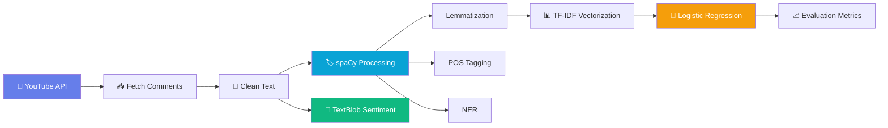

<p align="center">
  
  
  
  
  
</p>

<h1 align="center">🎬 YouTube Comment Sentiment Analyzer</h1>

<p align="center">
  <strong>An NLP-powered pipeline that fetches, processes, and visualizes YouTube comments <br/> using spaCy POS tagging, TextBlob sentiment analysis, and scikit-learn ML classification.</strong>
</p>

---

## ✨ Features

| Feature | Description |
|---------|-------------|
| 🔗 **YouTube API Integration** | Fetches up to 10,000 comments with full pagination support |
| 🧹 **Text Preprocessing** | HTML/URL removal, lowercasing, regex cleaning |
| 🏷️ **spaCy POS Tagging** | Proper part-of-speech tagging using `en_core_web_sm` model |
| 📝 **Lemmatization** | spaCy-based lemmatization for better text normalization |
| 🔍 **Named Entity Recognition** | Identifies persons, organizations, locations, dates, etc. |
| 💬 **Sentiment Analysis** | TextBlob polarity  & subjectivity scoring (Positive / Neutral / Negative) |
| 🤖 **ML Classification** | Logistic Regression trained on TF-IDF features with train/test evaluation |
| 📊 **Interactive Dashboard** | Streamlit-powered dashboard with Plotly charts, word clouds, and more |
| 📥 **CSV Export** | Download analyzed results as a CSV file |

---

## 🛠️ Tech Stack

<table>
  <tr>
    <td align="center" width="120"><br/><b>Python</b></td>
    <td align="center" width="120"><br/><b>spaCy</b></td>
    <td align="center" width="120"><br/><b>Streamlit</b></td>
    <td align="center" width="120"><br/><b>scikit-learn</b></td>
    <td align="center" width="120"><br/><b>NumPy</b></td>
    <td align="center" width="120"><br/><b>Pandas</b></td>
  </tr>
</table>

| Library | Purpose |
|---------|---------|
| `spacy` | POS tagging, lemmatization, NER |
| `textblob` | Sentiment polarity & subjectivity |
| `scikit-learn` | TF-IDF vectorization, Logistic Regression, metrics |
| `streamlit` | Interactive web dashboard |
| `plotly` | Interactive charts & visualizations |
| `wordcloud` | Sentiment-based word cloud generation |
| `google-api-python-client` | YouTube Data API v3 integration |
| `matplotlib` | Word cloud rendering |

---

## 🚀 Quick Start

### Prerequisites

- **Python 3.11+**
- **YouTube Data API v3 Key** → [Get one here](https://console.cloud.google.com/apis/credentials)

### Installation

```bash
# 1. Clone the repository
git clone https://github.com/ThePrinceM/YT_Comments_Sentiment_Analysis.git
cd YT_Comments_Sentiment_Analysis

# 2. Install dependencies
pip install spacy streamlit plotly wordcloud google-api-python-client textblob scikit-learn pandas numpy matplotlib

# 3. Download the spaCy English model
python -m spacy download en_core_web_sm

# 4. Create Streamlit secrets for your API key
mkdir .streamlit
echo YOUTUBE_API_KEY = "your_api_key_here" > .streamlit/secrets.toml
```

### Run the Dashboard

```bash
python -m streamlit run dashboard.py
```

The app will open at **http://localhost:8501** 🎉

---

## 📁 Project Structure

```
YT_Comments_Sentiment_Analysis/
│
├── dashboard.py               # 🖥️  Streamlit dashboard (main app)
├── .streamlit/secrets.toml    # 🔑  YouTube API key (git-ignored)
├── .gitignore                 # 🚫  Git ignore rules
└── README.md                  # 📖  This file
```

---

## 📊 Dashboard Tabs

The Streamlit dashboard is organized into **5 interactive tabs**:

### 📊 Tab 1 — Sentiment Analysis
> Visualize the overall sentiment distribution of comments.
- 🍩 **Donut chart** — Positive / Neutral / Negative proportions
- 📊 **Bar chart** — Sentiment count comparison
- 🔵 **Scatter plot** — Polarity vs. Subjectivity mapping
- 📈 **Histogram** — Polarity distribution curve
- ☁️ **Word clouds** — Top words per sentiment category

### 🏷️ Tab 2 — POS Tagging
> Explore part-of-speech distributions powered by spaCy.
- 📊 **POS distribution bar chart** — Frequency of NOUN, VERB, ADJ, etc.
- 🔝 **Top words by POS** — Most frequent nouns, verbs, adjectives
- 🔬 **Interactive POS tagger** — Type any text and see color-coded POS tags in real time

### 🔍 Tab 3 — Named Entities
> Discover people, organizations, and places mentioned in comments.
- 📊 **Entity type distribution** — PERSON, ORG, GPE, DATE counts
- 🏆 **Top 20 entities** — Most frequently mentioned named entities

### 🤖 Tab 4 — ML Metrics
> Evaluate the trained Logistic Regression classifier.
- 📋 **Classification report** — Precision, recall, F1-score per class
- 🟪 **Confusion matrix** — Heatmap of actual vs. predicted labels
- 📊 **F1 score comparison** — Bar chart across sentiment categories

### 💬 Tab 5 — Comment Explorer
> Browse individual comments with full NLP annotations.
- 🔎 **Filter by sentiment** — View only Positive, Neutral, or Negative
- 🏷️ **POS tags per comment** — Color-coded token-level annotation
- 🔍 **Named entities per comment** — Extracted entities displayed inline
- 📥 **CSV download** — Export all analyzed data

---

## 🔬 NLP Pipeline



### Pipeline Steps

| Step | Tool | Description |
|------|------|-------------|
| 1️⃣ **Fetch** | YouTube API v3 | Paginated comment retrieval (up to 10K) |
| 2️⃣ **Clean** | Regex | Remove URLs, HTML tags, entities, non-alpha chars |
| 3️⃣ **Process** | spaCy `en_core_web_sm` | Tokenization, lemmatization, POS tagging, NER |
| 4️⃣ **Sentiment** | TextBlob | Polarity score → Positive / Neutral / Negative |
| 5️⃣ **Vectorize** | TF-IDF (5000 features) | Convert processed text to numerical features |
| 6️⃣ **Train** | Logistic Regression | 80/20 train-test split, model fitting |
| 7️⃣ **Evaluate** | scikit-learn metrics | Accuracy, precision, recall, F1-score, confusion matrix |

---

## 🔑 Streamlit Secrets

| Variable | Description |
|----------|-------------|
| `YOUTUBE_API_KEY` | Your YouTube Data API v3 key |

Create a `secrets.toml` file in the `.streamlit` directory:

```toml
YOUTUBE_API_KEY = "your_youtube_api_key_here"
```

> ⚠️ **Never commit your API key!** The `.gitignore` already excludes the `.streamlit/secrets.toml` file.

---

1. **Add** your YouTube API key to `.streamlit/secrets.toml`
2. **Launch** the dashboard → `python -m streamlit run dashboard.py`
3. **Paste** any YouTube video URL
4. **Adjust** the max comments slider (100–10,000)
5. **Click** 🚀 Analyze Comments
6. **Explore** all 5 tabs with interactive visualizations
7. **Download** results as CSV from the Comment Explorer tab

---

## 🤝 Contributing

Contributions are welcome! Feel free to:

1. Fork the repository
2. Create a feature branch (`git checkout -b feature/amazing-feature`)
3. Commit changes (`git commit -m 'Add amazing feature'`)
4. Push to branch (`git push origin feature/amazing-feature`)
5. Open a Pull Request

---

## 🙏 Acknowledgements

- [spaCy](https://spacy.io/) — Industrial-strength NLP
- [Streamlit](https://streamlit.io/) — The fastest way to build data apps
- [TextBlob](https://textblob.readthedocs.io/) — Simplified text processing
- [Plotly](https://plotly.com/) — Interactive graphing library
- [YouTube Data API](https://developers.google.com/youtube/v3) — Comment data source

---

<p align="center">
  Authored and Published by *Prince Maurya*
</p>
